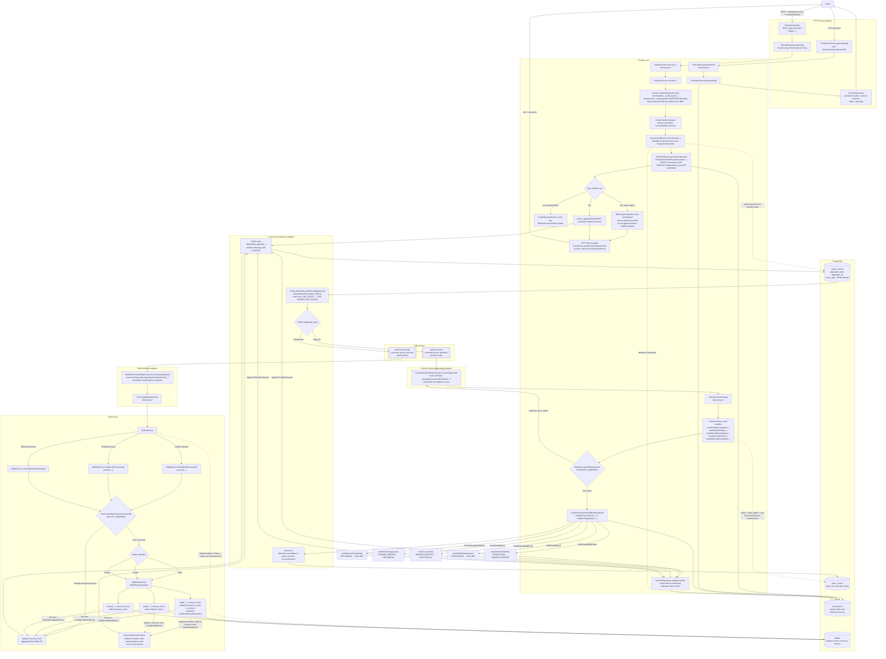

```mermaid
    flowchart TD
    CLIENT["Client"]

    subgraph HTTP["HTTP driving adapter"]
        TC["TransferController<br/>POST /api/v1/transfers<br/>initiate(...)"]
        TRQ["TransferRequest.toMoney()<br/>CurrencyType.fromCode(currency)"]
        GET["TransferController.get(transferId)<br/>GET /api/v1/transfers/{transferId}"]
        GETRESP["TransferResponse<br/>transferId, wallets, amount, currency,<br/>status, message"]
    end

    subgraph TRANSFER_CORE["Transfer core"]
        INIT["InitiateTransfer.execute(...)<br/>inbound port"]
        TS["TransferService.execute(...)"]
        BUILD["Transfer.initiate(idempotencyId)<br/>fromSender(...).toReceiver(...)<br/>withAmount(...).viaAcquisition(PEER2PEER).build()<br/>Money.requirePositive(); wallets must differ"]
        DEBITCMD["Create DebitCommand<br/>eventId, transferId, sourceWalletId, amount"]
        RUNNER["TransactionRunner.inTransaction(...)<br/>SpringTransactionRunner uses TransactionTemplate"]
        INSERT["TransferRepository.insert(requested)<br/>PostgresTransferRepository.insert(...)<br/>INSERT transactions ON CONFLICT(idempotency_key) DO NOTHING"]
        ISNEW{"New transfer row?"}
        SAME["Matching idempotency key and payload<br/>return existing transferId<br/>do not append another DebitCommand"]
        CONFLICT["Conflicting payload for same key<br/>IdempotencyConflictException"]
        APPENDDEBIT["Outbox.append(TRANSFER, transferId, DebitCommand)"]
        ACCEPT["HTTP 202 Accepted<br/>TransferAcceptedResponse(transferId)<br/>Location: /api/v1/transfers/{transferId}"]
        GETPORT["GetTransfer.get(transferId)<br/>inbound port"]
        GETSVC["TransferService.get(transferId)"]
        SAGA["AdvanceTransferSaga<br/>inbound port"]
        HANDLERS["TransferService event handlers<br/>handleDebitCompleted(...)<br/>handleDebitFailed(...)<br/>handleCreditCompleted(...)<br/>handleCreditFailed(...)<br/>handleRefundCompleted(...)"]
        DUPTRANSFER{"JdbcInbox.markIfNew(eventId,<br/>TRANSFER_WORKER)?"}
        LOADTRANSFER["TransferRepository.findById(transferId)<br/>validateSourceEvent(...) or validateTargetEvent(...)"]
        UPDATETRANSFER["TransferRepository.update(transfer,<br/>expectedPreviousStatus)<br/>optimistic status check"]
    end

    subgraph COMMON["Common persistence adapters"]
        OUTBOX["Outbox port<br/>JdbcOutbox.append(...)<br/>serialize Message with eventType"]
        INBOX["Inbox port<br/>JdbcInbox.markIfNew(...)<br/>unique eventId + consumerName"]
        RELAY["OutboxRelayJob.publishPendingEvents()<br/>@Scheduled fixed delay: 500 ms<br/>batch size: 100; SELECT ... FOR UPDATE SKIP LOCKED"]
        ROUTE{"Outbox aggregate_type"}
    end

    subgraph DB["PostgreSQL"]
        TXTABLE[("transactions<br/>transfer state and idempotency key")]
        WALLET_TABLE[("wallets<br/>balance_minor, currency, version")]
        OUTBOX_TABLE[("outbox_events<br/>aggregate_type, aggregate_id,<br/>event_type, JSON payload")]
        INBOX_TABLE[("inbox_events<br/>event_id, consumer_name")]
    end

    subgraph KAFKA["Kafka broker"]
        WC_TOPIC[["wallet-commands<br/>consumer group: quickwal-wallet-worker"]]
        TE_TOPIC[["transfer-events<br/>consumer group: quickwal-transfer-worker"]]
    end

    subgraph WALLET_ADAPTER["Wallet inbound adapter"]
        WKC["WalletCommandKafkaConsumer.consume(payload)<br/>read eventType; MessageType.fromWireName(...)<br/>deserialize and dispatch command"]
        PROCESS["ProcessWalletCommand<br/>inbound port"]
    end

    subgraph WALLET_CORE["Wallet core"]
        WS["WalletService"]
        DEBIT["WalletService.debit(DebitCommand)<br/>process(...)"]
        CREDIT["WalletService.credit(CreditCommand)<br/>process(...)"]
        REFUND["WalletService.refund(RefundCommand)"]
        DEDUPW{"Inbox.markIfNew(command.eventId,<br/>WALLET_WORKER)?"}
        MUTATE{"Wallet operation"}
        REPO["WalletRepository<br/>WalletRepositoryImpl"]
        DEBITSQL["debit(...): currency check;<br/>subtract if balance_minor >= amount;<br/>otherwise InsufficientFundsException"]
        CREDITSQL["credit(...): currency check;<br/>add to balance_minor"]
        REFUNDSQL["refund(...): currency check;<br/>add to balance_minor"]
        WALLETOK["Append success event<br/>AggregateType.WALLET"]
        WALLETFAIL["Known debit/credit failure:<br/>rollback mutation, then append failure event<br/>in a new transaction"]
    end

    subgraph TRANSFER_ADAPTER["Transfer inbound messaging adapter"]
        TEC["TransferEventKafkaConsumer.consume(payload)<br/>read eventType; MessageType.fromWireName(...)<br/>deserialize and dispatch event"]
    end

    CLIENT -->|"POST + Idempotency-Key + TransferRequest"| TC
    TC --> TRQ --> INIT --> TS
    TS --> BUILD --> DEBITCMD --> RUNNER --> INSERT
    INSERT --> TXTABLE
    INSERT --> ISNEW
    ISNEW -->|"Yes"| APPENDDEBIT
    APPENDDEBIT --> OUTBOX
    OUTBOX --> OUTBOX_TABLE
    ISNEW -->|"No; same request"| SAME --> ACCEPT
    ISNEW -->|"No; payload differs"| CONFLICT
    APPENDDEBIT --> ACCEPT
    ACCEPT -->|"202 + transferId"| CLIENT

    CLIENT -->|"GET transferId"| GET --> GETPORT --> GETSVC --> TXTABLE
    GETSVC --> GETRESP --> CLIENT

    OUTBOX_TABLE --> RELAY --> ROUTE
    ROUTE -->|"TRANSFER"| WC_TOPIC
    ROUTE -->|"WALLET"| TE_TOPIC

    WC_TOPIC --> WKC --> PROCESS --> WS
    WS -->|"DebitCommand"| DEBIT
    WS -->|"CreditCommand"| CREDIT
    WS -->|"RefundCommand"| REFUND

    DEBIT --> DEDUPW
    CREDIT --> DEDUPW
    REFUND --> DEDUPW
    DEDUPW -->|"Already processed: ignore"| WALLETOK
    DEDUPW -->|"New command"| MUTATE

    MUTATE -->|"Debit"| REPO --> DEBITSQL --> WALLET_TABLE
    MUTATE -->|"Credit"| REPO --> CREDITSQL --> WALLET_TABLE
    MUTATE -->|"Refund"| REPO --> REFUNDSQL --> WALLET_TABLE

    DEBITSQL -->|"Success: DebitCompletedEvent"| WALLETOK
    DEBITSQL -->|"Insufficient funds / wallet or currency error:<br/>DebitFailedEvent"| WALLETFAIL
    CREDITSQL -->|"Success: CreditCompletedEvent"| WALLETOK
    CREDITSQL -->|"Wallet or currency error:<br/>CreditFailedEvent"| WALLETFAIL
    REFUNDSQL -->|"Success: RefundCompletedEvent"| WALLETOK

    WALLETOK --> OUTBOX
    WALLETFAIL --> OUTBOX

    TE_TOPIC --> TEC --> SAGA --> HANDLERS
    HANDLERS --> DUPTRANSFER
    DUPTRANSFER -->|"Duplicate event: ignore"| TEC
    DUPTRANSFER -->|"New event"| LOADTRANSFER
    LOADTRANSFER --> TXTABLE
    LOADTRANSFER --> INBOX
    INBOX --> INBOX_TABLE

    LOADTRANSFER -->|"DebitCompletedEvent"| DEBITDONE["markSenderDebited()<br/>PROCESSING → SENDER_DEBITED"]
    DEBITDONE --> UPDATETRANSFER --> TXTABLE
    DEBITDONE -->|"Append CreditCommand"| OUTBOX

    LOADTRANSFER -->|"DebitFailedEvent"| DEBITFAILED["markDebitFailed(reason)<br/>PROCESSING → FAILURE"]
    DEBITFAILED --> UPDATETRANSFER

    LOADTRANSFER -->|"CreditCompletedEvent"| CREDITDONE["markSuccessful()<br/>SENDER_DEBITED → SUCCESSFUL"]
    CREDITDONE --> UPDATETRANSFER

    LOADTRANSFER -->|"CreditFailedEvent"| CREDITFAILED["markRefunding(reason)<br/>SENDER_DEBITED → REFUNDING"]
    CREDITFAILED --> UPDATETRANSFER
    CREDITFAILED -->|"Append RefundCommand"| OUTBOX

    LOADTRANSFER -->|"RefundCompletedEvent"| REFDONE["markRefundCompleted()<br/>REFUNDING → FAILURE"]
    REFDONE --> UPDATETRANSFER

    RUNNER -. "database transaction" .-> TXTABLE
    RUNNER -. "same transaction as transfer insert" .-> OUTBOX_TABLE
    WS -. "wallet mutation + inbox + outbox are transactional" .-> WALLET_TABLE
    HANDLERS -. "inbox + state update + any next command are transactional" .-> INBOX_TABLE
```
